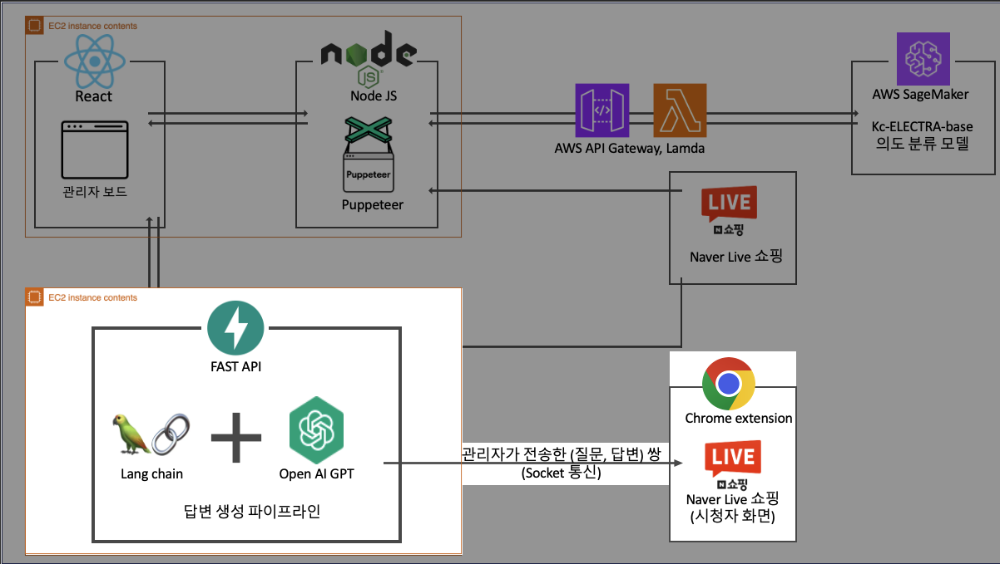

# 라이브 커머스 UX 향상 프로젝트 🛍️
### 라이브 커머스 특성 : 요청 및 질문의 의도를 갖는 채팅이 무수히 많음 (최대 분당 2만건)
### 라이브커머스 관리자와 시청자 사이의 원활한 쌍방향 소통을 위한 서비스
- **실시간 채팅**에 대한 **의도(일반, 요청, 질문) 자동 분류**
- 질문의 의도를 갖는 채팅에 대해서 상품 정보를 기반으로 **답변 자동 생성**

## MSA 프로젝트 구조
- 각 서비스의 기능과 특성에 맞게 기술 스택을 유연하게 사용할 수 있도록 MSA 구조를 도입하였습니다.

### 라이브 커머스 관리자 보드 (Javascript-React)
- 라이브 커머스 관리자가 사용하게 될 웹 Front-End 서비스 입니다.
- Javascript-React 를 사용하여 구축하였습니다.
- UI를 재사용 가능한 컴포넌트 기반 구조와 다양한 라이브러리 및 Back-End 와의 통신 방법을 제공하기 때문입니다.

### Node JS 웹 서버
- Naver Live 쇼핑 서비스, 라이브 커머스 관리자 보드 및 의도 분류 모델 API와 통신을 수행하는 Back-End 서비스 입니다.
- Javascript-NodeJS 를 사용하여 구축하였습니다.
- 핵심 역할인 Naver Live 쇼핑의 실시간 채팅 수신을 위해 웹 소켓 기능을 지원하는 Puppeteer 라이브러리를 제공하기 때문입니다.

### AWS 의도 분류 모델 API
- 실시간 채팅에 대하여 의도(일반, 질문, 요청) 분류를 수행하는 API 서비스 입니다.
- AWS의 AWS API Gateway, Lambda, SageMaker 를 사용하여 구축하였습니다.
- AI Model 의 배포(end-point) 기능을 제공하는 SageMaker 를 사용하여 쉽게 API 서비스를 구축할 수 있기 때문입니다.

### Fast API 웹 서버
- 질문 채팅에 대해서 답변 생성 역할을 수행하는 Back-End 서비스 입니다. 추가로, 관리자가 전송한 (질문, 답변) 쌍을 라이브 커머스 시청자(Chrome Extension)에 전달하는 역할도 수행합니다.
- Python 의 웹 서버 프레임워크인 Fast API 를 사용하여 구축하였습니다.
- LLM Application 인 LangChain 을 Python 언어가 지원하기 때문입니다.

### 라이브 커머스 시청자 화면 With Chrome Extension
- 실제 Naver Live 쇼핑의 시청자 채팅 화면에 관리자가 전송한 (질문, 답변)쌍을 보여주기 위한 크롬 확장 프로그램 입니다.
- Chrome Extension 을 사용하여 구축하였습니다.
- Chrome UI를 개발자가 수정할 수 있으며, Background 에서 Web Socket 기능을 지원하기 때문입니다.

# 프로젝트 흐름
## 1. 라이브 커머스 관리자 방송 준비
- 라이브 커머스 관리자가 관리자 보드에 접속하여, 방송에 대한 정보(URL, 방송 정보, 상품 정보)를 입력하는 단계 입니다.
### 관리자 보드에 접속하여, Naver Live 쇼핑 방송 URL 을 입력합니다.

### Puppeteer 의 COP Session 기능을 이용하여 방송에서 진행할 상품 목록 정보를 수신합니다. 

### 방송 및 상품에 대한 정보를 입력 및 상품에 대한 상세 정보 페이지로부터 Q&A 정보를 크롤링 합니다.
- 해당 정보는 이후 질문 채팅에 대한 답변 생성 시, LLM 의 참고 문서로 사용됩니다.

## 2. 라이브 커머스 방송 진행 (채팅 의도 분류)
- 라이브 커머스 방송이 시작되며, 시청자의 채팅에 대한 의도 분류가 진행됩니다.
### Puppeteer 의 COP Session 기능을 이용하여 방송의 실시간 채팅을 스트리밍합니다.

### 실시간 채팅에 대해서 AWS 의도 분류 모델 API 를 통해 의도 분류를 수행합니다.

### 의도 분류된 결과는 관리자 보드에 전송됩니다.

## 3. 라이브 커머스 방송 진행 (질문 채팅에 대한 답변 자동 생성 및 전송)
- 질문 채팅으로 의도가 분리된 채팅들에 대하여 답변이 자동 생성되며 시청자에게 (질문, 답변)쌍을 전달합니다.
### 관리자가 답변을 생성하고 싶은 질문 채팅을 클릭하게 되면, Fast API 웹 서버에게 답변이 자동 생성을 요청합니다.

### 관리자가 답변을 전송하게 되면, Fast API 웹 서버에게 (질문, 답변)쌍이 전달됩니다.
- 해당 정보(질문, 답변)은 LLM 답변 생성시 참고 문서로 추가되어 더 정확한 답변을 생성할 수 있도록 합니다.

### Fast API 웹 서버에서 현재 방송을 시청중인 시청자들의 화면(Chrome Extension)에 웹 소켓 방식으로 (질문, 답변)쌍을 전달합니다.

